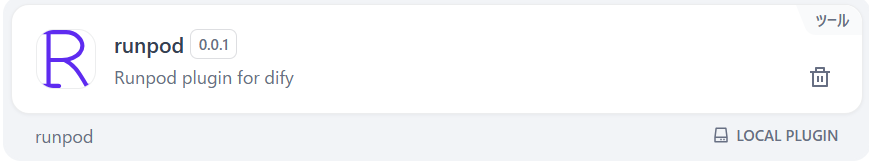
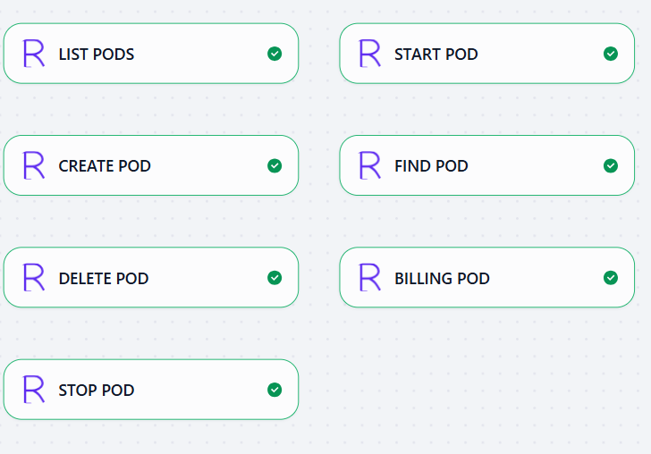
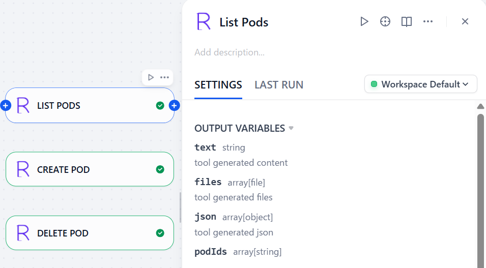
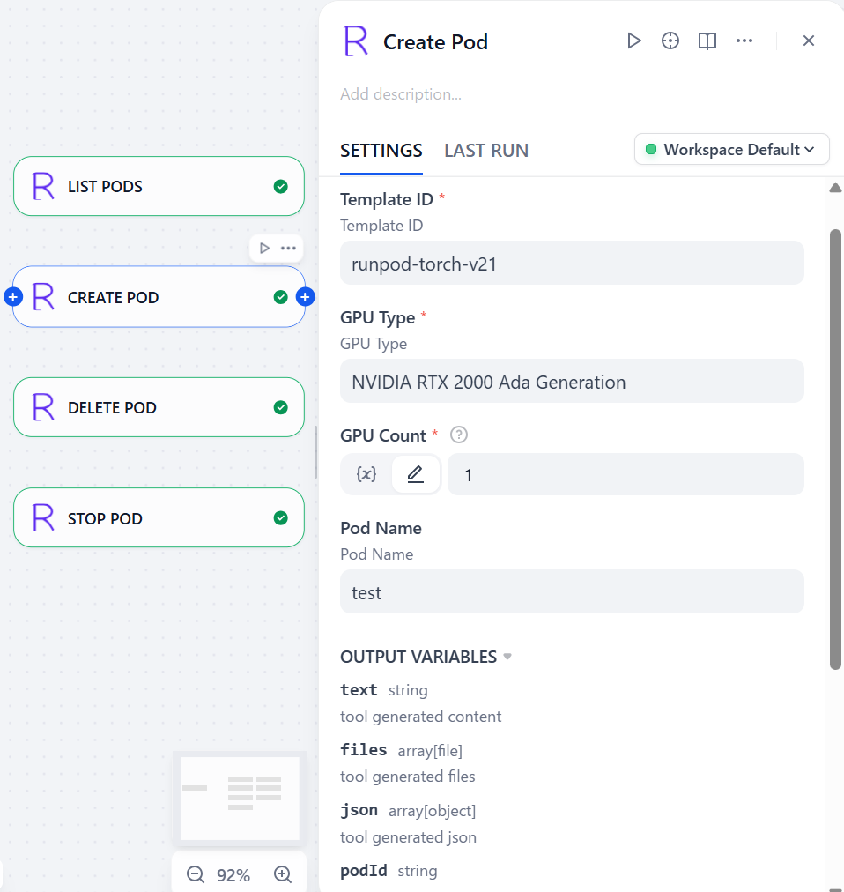
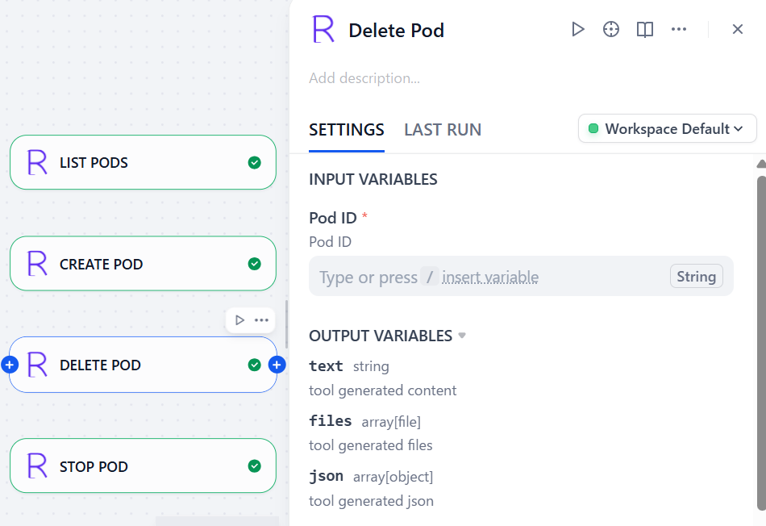
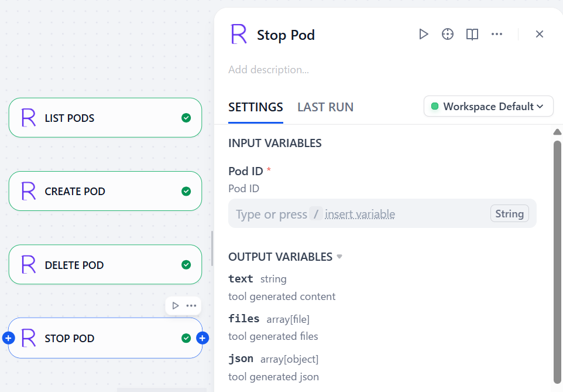
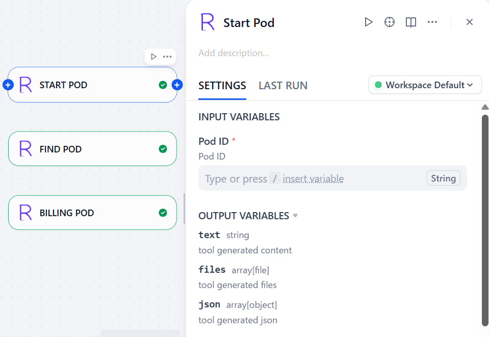
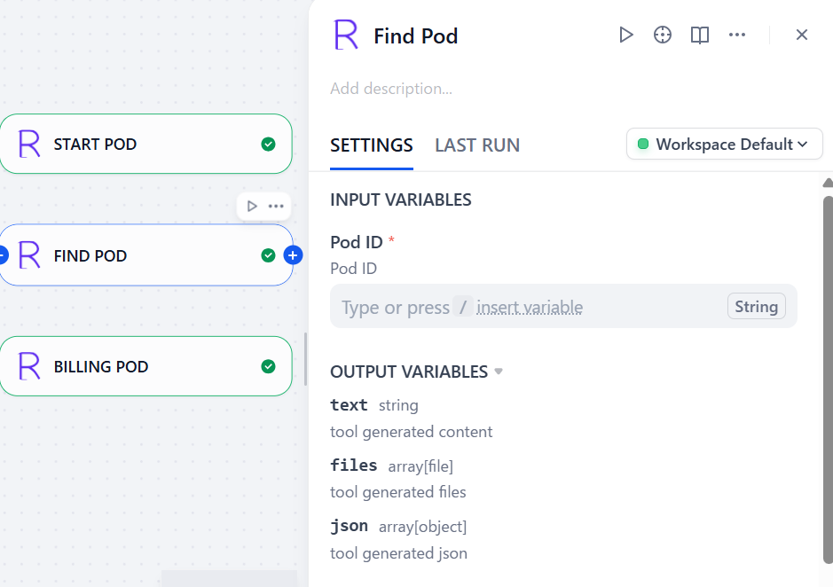
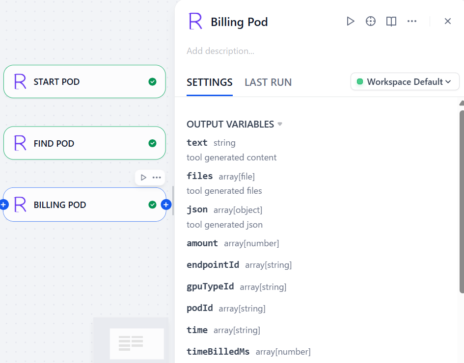

## runpod

**Author:** yt-koike
**Version:** 0.0.1
**Type:** tool

### Description

This is an unofficial Runpod plugin for Dify and is basically [Runpod Rest API](https://docs.runpod.io/api-reference/overview) turned into Dify nodes.
So far this plugin only supports API calls related to Pods.

### Setup

You can simply use this plugin by installing it.

## Nodes

This plugin has various nodes to use Runpod API.

### List Pods

List Pods node returns pod IDs.

### Create Pod

Create Pod node creates pods based on the config and returns the ID of newly created pod.

### Delete Pod

Delete Pod node deletes the pod refered by the pod ID.

### Stop Pod

Stop Pod node stops the pod refered by the pod ID.

### Start Pod

Start Pod node starts or resumes the pod refered by the pod ID.

### Find Pod

Find Pod node finds the pod refered by the pod ID and returns the detail information about it.

### Billing Pod

Billing Pod node returns the billing history related to pods.

### Required APIs and Credentials

This plugin requires a Runpod API Key to access to Runpod REST API.

### Reference

- Runpod API Reference: https://docs.runpod.io/api-reference/overview
- Logo: Made on https://text-to-svg.com/
